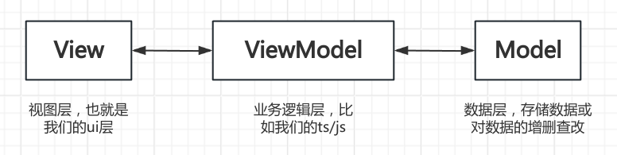
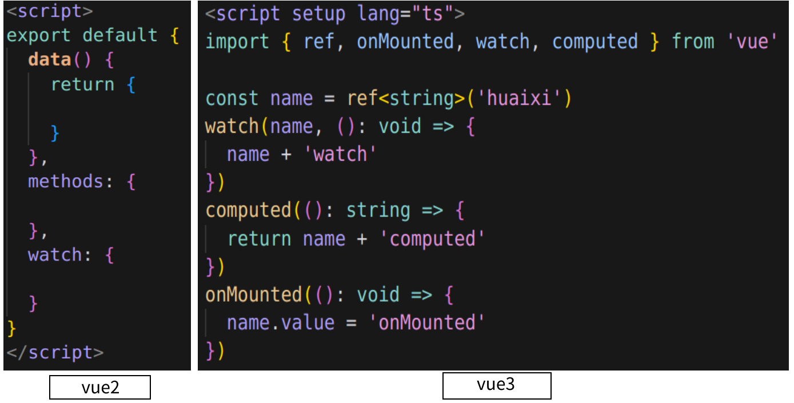

### vue框架总介绍
#### MVVM整体架构
  &ensp;vue为**MVVM**架构，即(*Model-View-ViewModel*)这样的逻辑，具体来说是这样的，*View*视图的更新会触发底层*Model*数据的更新，相反也是可以的，其中，这两者的更新都是借助*ViewModel*这个中间业务逻辑层实现的。
  &ensp;这样就保证了数据和视图的统一，使得我们可以只关注视图的变化，上文可以参考下图:
  

#### Vue2与Vue3的区别
  &ensp;从API的书写风格来看，vue2还是那种Options API的风格，但是vue3则是Composition API这种组合式的风格，很显然v3的更好看，其实vue3的本质是setup模式就是export default，这样我们不需要导出数据就可以使用
  

#### vue3的新特性
##### 双向数据绑定

[梦开始的地方](https://blog.csdn.net/qq1195566313/article/details/122768533)