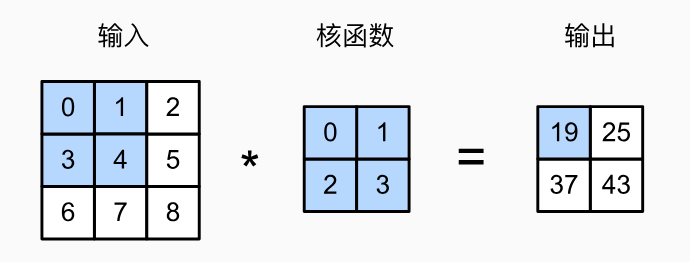
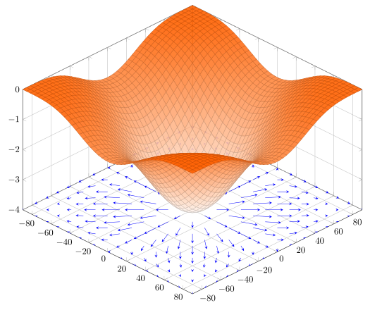
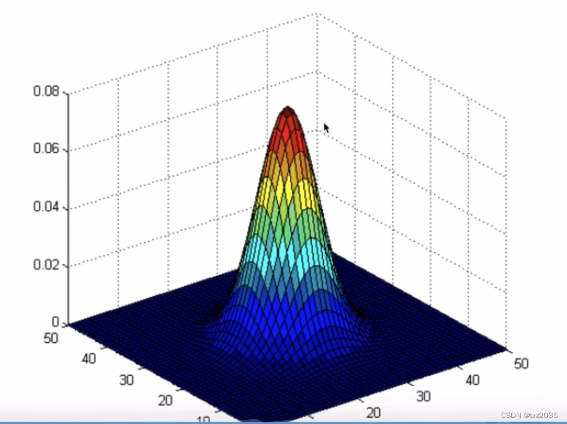
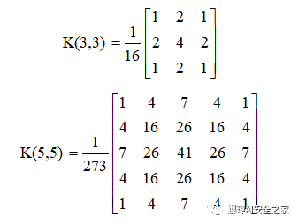
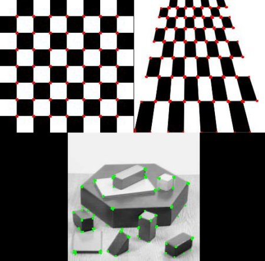
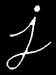
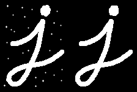
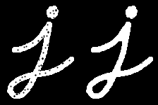
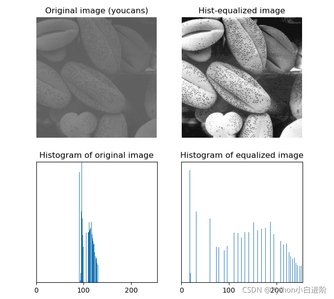

# OpenCV第二讲 各种特征的提取
## 卷积与邻域特征
### - 图像梯度,边缘检测与微分算子

什么是卷积?


卷积就是把一个邻域内的数进行加权, 然后求和

[opencv filter2D](https://docs.opencv.org/4.x/d4/d86/group__imgproc__filter.html#ga27c049795ce870216ddfb366086b5a04)

[填充(padding), 步幅(stride)](https://zh.d2l.ai/chapter_convolutional-neural-networks/padding-and-strides.html)和空洞([dilation](https://blog.csdn.net/mrjkzhangma/article/details/104929302))

锚点(anchor)是什么?

简单来说, 锚点是卷积结果相对卷积核的输出位置, 一般默认Point(-1,-1)即卷积核中心

仔细看会发现, 经过卷积之后的图像变小了, 如果不想让他变小就需要填充([cv::BorderTypes](https://docs.opencv.org/4.x/d2/de8/group__core__array.html#ga209f2f4869e304c82d07739337eae7c5))。注意, 填充是在卷积开始前进行

梯度：多元函数的导数


把灰度图像想像成一个二元函数, z(x,y), 其中z就是图像的亮度

那么灰度图像的梯度简单来说就是**亮度沿着x或y的变化**

事实上我们很少对三通道函数直接求梯度, 一般是转为灰度图像后再操作, 因为效果差异不大

[什么是图像边缘?](https://docs.opencv.org/4.x/d2/d2c/tutorial_sobel_derivatives.html)

sobel算子：
```
x = [-3	 0  +3
	-10  0  +10
	 -3	 0  +3]
 
y = [-3	-10 -3
	  0  0  0
	 +3	+10 +3]
```

图像边缘就是梯度吗?

显然不是, 梯度包含了变化的方向信息, 而图像边缘只是取了梯度的大小, 可以看作图像局部的变化大小

所以有很多不基于梯度的求图像边缘的算法, 当然效果一般不如sobel

laplacian算子如下, 其缺点是对噪声敏感
```
y = [ 0	 1  0
	  1 -4  1
	  0	 1  0]
```

[各个算子效果](https://blog.csdn.net/m0_50317149/article/details/129992642)

[canny算法：基于sobel的边缘检测过程](https://docs.opencv.org/4.x/da/d22/tutorial_py_canny.html)(canny不是算子, 是一个使用sobel算子的算法流程)

	- 高斯降噪
	- 寻找图像梯度
	- 非极大值抑制(细化边缘)
	- 连接边缘

### - 噪点与滤波

什么是图像滤波?

图像的实质是一种二维信号, 滤波是信号处理中的一个重要概念。
滤波是将信号中特定波段频率滤除的操作, 图像滤波的主要目的就是在尽量保留图像细节特征的条件下对目标图像的噪声进行抑制, 图像的噪声实际上就是高频信号, 图像滤波主要是低通滤波, 即去除噪声这种高频信号

常见的滤波算法都基于卷积实现

均值滤波, 中值滤波和双边滤波
```
cv::blur(	InputArray 	src, 
			OutputArray dst, 
			Size 		ksize, 
			Point 		anchor=Point(-1,-1), 
			int 		borderType=BORDER_DEFAULT)

cv::medianBlur(	InputArray 	src,
				OutputArray dst, 
				int 		ksize)

cv::bilateralFilter(InputArray 		src,
					OutputArray 	dst,
					int 			d,  			//Filter size,  d=5比较合适
					double 			sigmaColor,     //滤波器核在颜色空间的方差, 反映产生颜色影响的颜色强度区间的大小
					double 			sigmaSpace,     //滤波器核在坐标空间的方差, 反映产生颜色影响的影响空间的大小

					int 			borderType = BORDER_DEFAULT)
```

经典非线性滤波
[双边滤波](https://homepages.inf.ed.ac.uk/rbf/CVonline/LOCAL_COPIES/MANDUCHI1/Bilateral_Filtering.html)可以较好地减少不需要的噪声, 同时保持边缘清晰, 然而它的速度非常慢

“缓慢空间变化的假设会在边缘处失败, 因此线性低通滤波使边缘变得模糊。我们如何防止跨边缘平均, 同时仍然在平滑区域内平均?“

那就是使用另一种建模方式：假设一个邻域内有两个范围内的值。只将 x 处的像素值替换为邻域内**相似**像素值的平均值。

高斯滤波：最常见的滤波方式, 也是线性滤波





高斯滤波比起中值均值滤波能保留更多细节信息

### - 角点检测与Harris算子

“它基本上找到了各个方向上的强度差异 。”

$E(u,v) = \sum_{x,y} \underbrace{w(x,y)}_\text{window function} \, [\underbrace{I(x+u,y+v)}_\text{shifted intensity}-\underbrace{I(x,y)}_\text{intensity}]^2$

矩阵形式：$M = \sum_{x,y} w(x,y) \begin{bmatrix}I_x I_x & I_x I_y \\
                                     I_x I_y & I_y I_y \end{bmatrix}$
 , $I_x$和$I_y$是x和y方向的图像导数

得到这块邻域的评分 $R = \det(M) - k(\operatorname{trace}(M))^2$

- $|R|$很小时区域平坦
- $R<0$时区域是边缘
- $R$很大时区域是角点


```
cv::cornerHarris(	InputArray 		src,
					OutputArray 	dst,
					int 			blockSize,
					int 			ksize,
					double 			k,
					int 			borderType  = BORDER_DEFAULT)

cornerSubPix(...) 	//以亚像素精度找到角点位置
```



## 二值图像分析与形态学特征
### - 二值图像的连通性
- (膨胀, 腐蚀)[https://docs.opencv.org/3.4/db/df6/tutorial_erosion_dilatation.html]

可以用于彩色图像, 但一般用在二值化的图像中

膨胀：
将像素替换为邻域内的局部最大值


腐蚀：
将像素替换为邻域内的局部最小值


- 开、闭运算和(其他形态学变换)[https://docs.opencv.org/3.4/d3/dbe/tutorial_opening_closing_hats.html]

简单来说, 开运算就是先腐蚀后膨胀, 闭运算就是先膨胀后腐蚀

那么它有什么效果呢?

开运算使独立的亮点消失、使微弱连接的亮区域断开



闭运算使独立的空洞消失、使非常接近的亮区域连通



- 提取骨架：细化和剪枝

什么是二值图像的细化?
你看腐蚀过程, 不断腐蚀直到连通区域即将断开, 只剩下一个像素相连, 这个过程就是图像细化

什么是剪枝?
细化后的结果有一些无用的分岔, 把分岔去掉的过程就是剪枝

经过细化和剪枝, 我们得到[图像骨架](https://blog.csdn.net/wsp_1138886114/article/details/107330351)

## 图像分割与边缘特征
### - 分水岭算法

## 霍夫变换与几何特征
- 霍夫圆变换

什么是霍夫变换?我们简单地描述一下整个过程

首先建立霍夫空间。一个圆有x,y,r三个参数, 于是我们建立一个三维矩阵, 他有和图像相同的宽度(x)、高度(y)和一个r轴, r轴的范围是我们想要检测的圆的半径的范围。将里面的数全部置为0, 这里面的数是用来计数用的, 代表对应(x,y,r)的圆有几个。

对于图像中的每三个亮点(此时默认是灰度或二值化的图像, 即已经提取了边缘或经过了阈值化处理), 找出经过他们的圆, 给霍夫空间中对应位置(x,y,r)的数加1。

然后大家就应该明白了。霍夫空间中某个圆的计数越高, 代表图像中这个圆越明显。我们还会对(x,y,r)的值相邻的圆进行合并, 最终得到图像圆形的分布。

当然, 具体实现肯定会有所不同, 以下是opencv的[HoughCircles](https://docs.opencv.org/3.4/dd/d1a/group__imgproc__feature.html#ga47849c3be0d0406ad3ca45db65a25d2d):

```
cv::HoughCircles(
	InputArray 	image,	 //输入灰度图像(二值图像)
	OutputArray circles,
	int 		method,
	double 		dp,		 //霍夫空间分辨率与图像分辨率的反比
	double 		minDist, //检测到的圆的中心之间的最小距离, 小于该距离的圆会被合并
	double 		param1 = 100,
	double 		param2 = 100,
	int 		minRadius = 0,
	int 		maxRadius = 0 
)
```

- [霍夫直线变换](https://blog.csdn.net/poem_qianmo/article/details/26977557)

明白了霍夫圆变换, 大家理解直线变换就比较容易了, 直线只有两个参数(在笛卡尔坐标系是斜率和截矩, 在极坐标系是r和θ), 我们构造2维霍夫空间即可。[opencv的函数](https://docs.opencv.org/3.4/dd/d1a/group__imgproc__feature.html#ga8618180a5948286384e3b7ca02f6feeb)如下：

```
cv::HoughLines(
	InputArray 	image,
	OutputArray lines,
	double 		rho,		//参数r的精度
	double 		theta,		//参数θ的精度, 以弧度为单位(这里直线采用极坐标系)
	int 		threshold,
	double 		srn = 0,
	double 		stn = 0,
	double 		min_theta = 0,
	double 		max_theta = CV_PI
) 
```

有时候我们需要检测线段而非直线, 这时可以使用直线的概率霍夫变换

```
cv::HoughLinesP(
	InputArray 	image,
	OutputArray lines,
	double 		rho,
	double 		theta,
	int 		threshold,
	double 		minLineLength = 0,
	double 		maxLineGap = 0 
)
```

- 广义霍夫变换

“当我们希望提取的形状特征没有简单解析方程时, 使用广义霍夫变换。在这种情况下, 我们不使用曲线的参数方程, 而是使用查找表来定义边界位置和方向与霍夫参数之间的关系。”

幸好我们可以[调库](https://docs.opencv.org/3.4/da/ddc/tutorial_generalized_hough_ballard_guil.html), 大家了解一下这个方法就好

## [直方图均衡化](https://docs.opencv.org/3.4/d4/d1b/tutorial_histogram_equalization.html)与亮度特征

有的特征我们想留下来, 有的特征我们想消去。亮度特征不稳定, 随光照而大幅度改变, 直方图均衡化就是消除这种特征的方法之一。



直方图统计我们初中学过, 在这里其实就是把所有亮度用直方图进行统计。

通过这种统计, 我们会发现大部分图片的亮度分布不均, 于是我们可以通过变换把亮度调整得均匀。

```
cv::equalizeHist(InputArray src,OutputArray dst)	
```
## 基于视频的检测与变化特征
- 帧差法

就像他的名字一样, 把前后两帧图像相减, 得到变化的图像。这种方法简单有效, 但是对光照变化比较敏感。

- 光流

## 图像掩膜与特征提取
掩膜(mask)实际上就是一个二值图像, 他可以用来只对图像的某一部分进行操作(mask>=1), 对图像的另一部分(mask=0)进行忽略。

我们常常用掩膜表示感兴趣区域, 或者表示我们提取出来的特征
```

```


