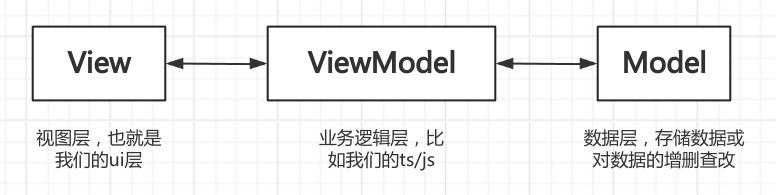

### vue框架总介绍
#### MVVM整体架构
  &ensp;vue为***MVVM***架构，即(*Model-View-ViewModel*)这样的逻辑，具体来说是这样的，*View*视图的更新会触发底层*Model*数据的更新，相反也是可以的，其中，这两者的更新都是借助*ViewModel*这个中间业务逻辑层实现的。
  &ensp;这样就保证了数据和视图的统一，使得我们可以只关注视图的变化，可以参考下图:
  

#### Vue2与Vue3的区别
  &ensp;从API的书写风格来看,vue2还是那种Options API的风格,但是vue3则是Composition API这种组合式的风格，很显然v3的更好看，其实vue3的本质是setup模式就是export default，这样我们不需要导出数据就可以使用
  

#### vue3的新特性
##### 双向数据绑定
  &ensp;双向绑定简单说就是：数据可以在data与view中做双向流动。Vue的数据绑定本质是通过数据劫持(*Data Hijacking*)和发布订阅模式(*Pub-Sub Pattern*)实现的，其中
  * 数据劫持：vue2通过Object.property方法实现，即对这个对象的get和set方法完成数据劫持，其中特别对array的一些例如push、pop这些方法进行了重写。vue3则是通过proxy，主要原因也是因为Object.property对数组并不是很友好。
  * 发布订阅模式：即通过监听数据变化并发布给对应对象，这样就实现了双向的数据传输

##### 优化Vdom
  &ensp;在vue2时，每次更新diff都是全量对比，但是vue3的话只会去对比带有标记的，来判断是否更新，这样可以大大减少消耗，如下面这个msg是个动态内容，故就会有一个*TEXT*标记，更新diff才会检查这个
  ```javascript
  export function render(_ctx, _cache, $props, $setup, $data, $options) {
    return (_openBlock(), _createElementBlock(_Fragment, null, [
      _createElementVNode("div", null, "Hello World"),
      _createElementVNode("span", null, _toDisplayString(_ctx.msg), 1 /* TEXT */)
    ], 64 /* STABLE_FRAGMENT */))
  }
  ```
##### Vue Fragement
  &ensp;整体来说，vue3以后支持template里写多个div了，原理也是Vdom这种，多了几个虚拟节点，并不会渲染

[梦开始的地方](https://blog.csdn.net/qq1195566313/article/details/122768533)